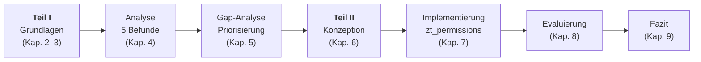
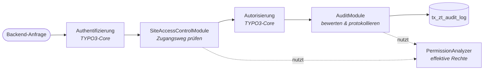

<div align="center">


# zt_permissions

**Erweiterung des TYPO3-Berechtigungsmodells auf Basis**</br>
**von Zero-Trust-Prinzipien im unternehmenskritischen Multi-Site-Einsatz**

[](https://get.typo3.org/version/14)
[](https://www.php.net/)
[](LICENSE)
[](#zitation)

[Über die Arbeit](#über-die-arbeit) ·
[Teil I: Analyse](#teil-i-analyse-des-berechtigungsmodells) ·
[Teil II: Extension](#teil-ii-die-extension-zt_permissions) ·
[Grenzen](#grenzen-und-ausblick) ·
[Installation](#extension-verwenden) ·
[Zitation](#zitation)

</div>

> „Think of VLANs as the yellow line on the road. Traffic is not supposed to cross that yellow line, but there’s nothing preventing a vehicle from doing so.“
>
> – John Kindervag, Begründer des Begriffs „Zero Trust“, zitiert in Abschn. 2.2

In einer TYPO3-Installation mit mehreren Websites ist die Grenze zwischen den Websites genau so eine Linie: „Es handelt sich um eine bloße „gelbe Linie“, die technisch nicht durchgesetzt ist.“ (Abschn. 4.2). Diese Bachelorarbeit untersucht, wie weit das Berechtigungsmodell von TYPO3 von Zero Trust entfernt ist, und schließt einen Teil dieser Lücke mit der TYPO3-Extension **`zt_permissions`**, die in diesem Repository enthalten ist.

---

## Über die Arbeit

### Ausgangslage

> „Das native Berechtigungsmodell von TYPO3 basiert auf einer rollenbasierten Zugriffskontrolle, bei der die Benutzerrechte überwiegend während der Konfiguration von Benutzern und Benutzergruppen festgelegt werden.“
>
> „Kontextbezogene Faktoren, wie der aktuelle Netzwerkstandort, das verwendete Endgerät oder Veränderungen am Sicherheitszustand eines Benutzers, haben keinen Einfluss auf die Zugriffsentscheidung.“
>
> „Unter anderem in Multi-Site-Betrieben kann es vorkommen, dass einmal gewährte Berechtigungen einen größeren Wirkungsbereich besitzen, als tatsächlich erforderlich wäre.“
>
> – Abschn. 1.1

Zero Trust ist längst ein etabliertes Sicherheitsmodell, wurde aber noch nie auf ein Content-Management-System übertragen:

> „Dadurch entsteht eine Forschungslücke an der Schnittstelle zwischen Zero-Trust-Architekturen und der Zugriffskontrolle moderner Content-Management-Systeme.“
>
> – Abschn. 1.1

### Forschungsfrage

> **(1)** Inwieweit erfüllt das native Berechtigungsmodell von TYPO3 bereits die Anforderungen einer Zero-Trust-Architektur?
>
> **(2)** Wie lässt sich dieses Modell durch eine TYPO3-Extension im Sinne der Zero-Trust-Prinzipien erweitern, ohne den Core des Systems zu verändern?
>
> – Abschn. 1.2

> „Ziel der Arbeit ist es, einen praxisnahen Ansatz aufzuzeigen, mit dem sich ausgewählte Zero-Trust-Prinzipien in das bestehende Berechtigungsmodell von TYPO3 integrieren lassen, ohne dabei den Core des Systems verändern zu müssen.“
>
> – Abschn. 1.2

### Vorgehen

> „Die Arbeit verbindet methodisch eine Architekturanalyse mit einem praktischen Nachweis in einer DDEV-basierten Multi-Site-Umgebung. Die Analyse wird um eine Auswertung von 92 TYPO3-Core-Security-Advisories aus den vergangenen fünf Jahren ergänzt.“
>
> – Kurzfassung



### Ergebnis

|                 | Antwort der Arbeit (Abschn. 9.2)                                                                                                                                                                                                                                                                            |
| --------------- | ----------------------------------------------------------------------------------------------------------------------------------------------------------------------------------------------------------------------------------------------------------------------------------------------------------- |
| **Teilfrage 1** | „Im Verlauf der Analyse stellte sich heraus, dass von den betrachteten Grundprinzipien von Haus aus keines vollständig erfüllt wird.“                                                                                                                                                                       |
| **Teilfrage 2** | „Im Laufe der vorliegenden Arbeit hat sich bestätigt, dass der entstandene Prototyp die native Autorisierungslogik lediglich ergänzt, jedoch nicht ersetzt. Die Erweiterung wirkt damit als zusätzlicher Policy Enforcement Point, statt als eigenständiger Policy Decision Point im Sinne von Rose et al.“ |

| Zero-Trust-Prinzip          | Ergebnis                                      | Komponente der Extension     |
| --------------------------- | --------------------------------------------- | ---------------------------- |
| **Micro-Segmentation**      | ✅ technisch durchgesetzt                     | Multi-Site-Zugriffskontrolle |
| **Least Privilege**         | 🔍 überprüfbar gemacht                        | Least-Privilege Audit-Modul  |
| **Continuous Verification** | ❌ ohne Eingriff in den Core nicht erreichbar | –                            |

<details>
<summary><b>Kurzfassung der Bachelorarbeit</b></summary>
<br>

> TYPO3 hat sich von einem reinen Werkzeug in der Websitepflege zu einem führenden Content-Management-System im Unternehmenseinsatz entwickelt. Mit dieser Entwicklung stößt sein statisches, rollenbasiertes Berechtigungsmodell immer mehr an seine Grenzen. Zahlreiche Studien und Implementierungen beschäftigen sich mit dem Sicherheitsstandard Zero Trust, jedoch wurde sein Modell bisher auf kein Content-Management-System übertragen. Die vorliegende Bachelorarbeit thematisiert, inwieweit das native Berechtigungsmodell die Anforderungen einer Zero-Trust-Architektur bereits erfüllt und wie es sich im Sinne deren Prinzipien in Form einer Extension erweitern lässt. Die Arbeit verbindet methodisch eine Architekturanalyse mit einem praktischen Nachweis in einer DDEV-basierten Multi-Site-Umgebung. Die Analyse wird um eine Auswertung von 92 TYPO3-Core-Security-Advisories aus den vergangenen fünf Jahren ergänzt. Die aus der Analyse entstandenen fünf Befunde werden zunächst den Prinzipien Least Privilege, Continuous Verification und Micro-Segmentation nach NIST SP 800-207 gegenübergestellt und anhand von Tragweite, empirischer Evidenz und Umsetzbarkeit priorisiert. Die implementierten Komponenten, das Audit-Modul und die Multi-Site-Zugriffskontrolle, werden anschließend im Rahmen einer Evaluierung auf ihre Funktionsweise überprüft. Von den betrachteten Prinzipien wird die Micro-Segmentation technisch durchgesetzt und das Least-Privilege lediglich überprüfbar gemacht, während die Continuous Verification ohne einen Eingriff in den Core unerreichbar bleibt. Die entworfene Erweiterung ergänzt damit die native Autorisierungslogik, ersetzt sie jedoch nicht.
>
> **Schlagwörter:** TYPO3, Content-Management-System, Zero Trust, Berechtigungsmodell, rollenbasierte Zugriffskontrolle

</details>

---

## Teil I: Analyse des Berechtigungsmodells

_Beantwortet Teilfrage 1 (Kapitel 2, 4 und 5 der Arbeit)._

### Zero Trust nach NIST SP 800-207

Zero Trust ersetzt den klassischen Grundsatz „trust, but verify“ durch „never trust, always verify“. Die Arbeit misst TYPO3 an drei Prinzipien, die sie aus den sieben Grundprinzipien (_Tenets_) der NIST Special Publication 800-207 von Rose et al. ableitet:

| Prinzip                     | Kerngedanke (Abschn. 2.1)                                                                                                                                                       | Tenets nach NIST |
| --------------------------- | ------------------------------------------------------------------------------------------------------------------------------------------------------------------------------- | :--------------: |
| **Least Privilege**         | „Das Prinzip der Least Privilege verlangt, die Zugriffe auf die Ressourcen in erster Linie auf jene Subjekte zu beschränken, die einen tatsächlichen Zugriffsbedarf aufweisen.“ |       3, 4       |
| **Continuous Verification** | „Das Vertrauen ist damit kein Zustand mehr, sondern ein wiederkehrender Vorgang.“                                                                                               |     5, 6, 7      |
| **Micro-Segmentation**      | „Die Grenze zwischen den Segmenten wird dabei nicht allein durch die Berechtigungslogik nachgebildet, sondern von einer eigenen Instanz technisch erzwungen.“                   |       1, 2       |

Als Schwachstelle gilt in der Arbeit jede Eigenschaft des TYPO3-Berechtigungsmodells, die „im Widerspruch zu mindestens einem der Zero-Trust-Grundprinzipien steht“ (Kap. 4).

### Fünf strukturelle Befunde

Alle Befunde wurden in einer DDEV-basierten Testumgebung mit zwei unabhängigen Sites (`site_a`, `site_b`) praktisch nachvollzogen.

<table>
<tr><th>#</th><th>Befund</th><th>Verletztes Prinzip</th></tr>
<tr>
<td>1</td>
<td><b>Additive Rechtevergabe</b><br>„Durch das Fehlen einer expliziten Einschränkung oder Aufhebung der Berechtigung kann die Zuordnung einer zusätzlichen Benutzergruppe den Berechtigungsumfang eines Benutzers nur erweitern, niemals einschränken.“ <sub>(4.1)</sub></td>
<td>Least Privilege</td>
</tr>
<tr>
<td>2</td>
<td><b>Administratorrolle</b><br>„Im Rahmen der Untersuchung ermöglichte eine Adminberechtigung ohne zugewiesenen Database Mount einen uneingeschränkten Zugriff auf der Ebene der Seiten- und Inhaltsverwaltung.“ <sub>(4.1)</sub></td>
<td>Least Privilege</td>
</tr>
<tr>
<td>3</td>
<td><b>Kontextunabhängige Rechtevergabe</b><br>„Im Rahmen der Testumgebung ließ sich die Anmeldung desselben Benutzers von unterschiedlichen IP-Adressen aus problemlos reproduzieren und in beiden Fällen bestand ein uneingeschränkter Zugriff auf das System.“ <sub>(4.1)</sub></td>
<td>Continuous Verification</td>
</tr>
<tr>
<td>4</td>
<td><b>Fehlende Trennung des Zugangswegs</b><br>„Eine Adminberechtigung bedeutet in diesem Fall eine unbegrenzte Verwaltungsmöglichkeit über alle Domänen.“ <sub>(4.2)</sub></td>
<td>Micro-Segmentation</td>
</tr>
<tr>
<td>5</td>
<td><b>„Show at any login“</b><br>„Nach einer erfolgreichen Anmeldung im Frontend von site_b war das Inhaltselement auf site_a unmittelbar sichtbar, obwohl der Benutzer keinerlei Berechtigung für site_a besaß und sich zu keinem Zeitpunkt gegenüber dieser Site authentifiziert hatte.“ <sub>(4.2)</sub></td>
<td>Micro-Segmentation</td>
</tr>
</table>

### Empirische Absicherung: 92 Security Advisories

Ergänzend wurden alle Core-Security-Advisories der vergangenen fünf Jahre ausgewertet:

| Kategorie                  | Anzahl | Relevanz für das Berechtigungsmodell |
| -------------------------- | -----: | ------------------------------------ |
| Broken Access Control      |     23 | ja                                   |
| Privilege Escalation       |      2 | ja                                   |
| Cross-Site Scripting       |     30 | ja                                   |
| Information Disclosure     |     18 | teilweise                            |
| Sonstige Sicherheitslücken |     19 | nein                                 |

<sub>Tabelle 4.1 der Arbeit, eigene Auswertung nach den offiziellen TYPO3 Security Advisories</sub>

> „Daraus lässt sich schließen, dass ca. 80 Prozent der untersuchten Advisories einen direkten oder indirekten Bezug zum Berechtigungsmodell aufweisen.“
>
> – Abschn. 4.3

### Gap-Analyse und Priorisierung

Die Befunde wurden in Anlehnung an das Common Vulnerability Scoring System (CVSS) nach drei Kriterien bewertet: **Tragweite** (entspricht _Impact_), **empirische Evidenz** (entspricht _Exploitability_) und **Umsetzbarkeit im Rahmen einer TYPO3-Extension**.

| Befund                            | Tragweite | Evidenz | Umsetzbarkeit |
| --------------------------------- | :-------: | :-----: | :-----------: |
| Additive Rechtevergabe            |   hoch    |  hoch   |   **hoch**    |
| Administratorrolle                |   hoch    |  hoch   |    niedrig    |
| Kontextunabhängige Rechtevergabe  |   hoch    |  hoch   |    niedrig    |
| Fehlende Trennung des Zugangswegs |   hoch    |  hoch   |   **hoch**    |
| Show at any login                 |   hoch    |  hoch   |   **hoch**    |

<sub>Tabelle 5.1 der Arbeit</sub>

> „Das tatsächliche Unterscheidungsmerkmal spiegelt sich in der Umsetzbarkeit im Rahmen einer TYPO3-Extension wider. Insgesamt erhalten dabei drei Befunde die höchste Priorität, da sie sich vollständig auf Grundlage der Extension-API ohne Core-Veränderung adressieren lassen.“
>
> – Abschn. 5.5

Die additive Rechtevergabe und die Administratorrolle werden unter dem Gesichtspunkt **Least Privilege** weiterverfolgt, die beiden Multi-Site-Befunde unter dem Gesichtspunkt **Micro-Segmentation**. Die kontextunabhängige Rechtevergabe bleibt bewusst außen vor:

> „Aus diesem Grund wird dieser Befund im weiteren Verlauf der Arbeit nicht konzeptionell adressiert, sondern im Rahmen der kritischen Reflexion als strukturelle Limitation ausgewiesen.“
>
> – Abschn. 5.3

### Antwort auf Teilfrage 1

> „Aus Sicht des Prinzips der Least Privilege fehlt grundsätzlich die Möglichkeit, einmal gewährte Berechtigungen gezielt wieder einzuschränken. Am weitesten entfernt sich das Modell vom Prinzip der Continuous Verification, denn eine einmal authentifizierte Sitzung bleibt in der Standardkonfiguration bis zu ihrem Ablauf, unabhängig von Zeitpunkt, Netzwerkstandort und Endgerät, unverändert vertrauenswürdig. Das Prinzip der Micro-Segmentation lässt sich in dem Sinne wiedererkennen, dass die Grenze zwischen den Segmenten durch die Berechtigungslogik nachgebildet, jedoch von keiner Instanz technisch erzwungen wird.“
>
> – Abschn. 9.2

---

## Teil II: Die Extension `zt_permissions`

_Beantwortet Teilfrage 2 (Kapitel 6, 7 und 8 der Arbeit)._

### Anforderungen und Ergebnis der Evaluierung

Aus der Priorisierung leitet die Arbeit fünf funktionale (FA) und vier nicht-funktionale Anforderungen (NFA) ab, jeweils mit einem Akzeptanzkriterium, das in Kapitel 8 geprüft wurde.

| Anforderung                                               | Akzeptanzkriterium (Abschn. 6.1)                                                       | Ergebnis (Kap. 8)     |
| --------------------------------------------------------- | -------------------------------------------------------------------------------------- | --------------------- |
| **FA1** Kritische Rechtekombinationen erkennen            | Schreibrecht auf `pages` plus weitere Berechtigung auf `be_users` wird erkannt         | ✅ erfüllt            |
| **FA2** Administrative Zugriffe protokollieren            | Zeitstempel, pseudonymisierte IP-Adresse und betroffener Ausschnitt werden erfasst     | ✅ erfüllt            |
| **FA3** Backend-Eingangspunkt an eine Site binden         | Ein nur `site_a` zugeordneter Benutzer wird über den Zugangsweg von `site_b` abgelehnt | 🟡 teilweise erfüllt¹ |
| **FA4** „Show at any login“ auf die eigene Site begrenzen | Die Beobachtung aus Abschn. 4.2 ist nicht mehr reproduzierbar                          | ✅ erfüllt            |
| **FA5** Benutzer einer oder mehreren Sites zuordnen       | Mehrere Sites je Benutzer, Backend- und Frontend-Zuordnungen getrennt                  | ✅ erfüllt            |
| **NFA1** Core unverändert                                 | Dateiweiser Vergleich: „für 27 Core-Pakete keine Abweichung“                           | ✅ erfüllt            |
| **NFA2** Kompatibel mit TYPO3 14.3 LTS                    | Aktiv registriert, keine offenen Upgrade-Wizards, keine Deprecations                   | ✅ erfüllt            |
| **NFA3** Zusatzlatenz unter 100 ms je Backend-Anfrage     | Median 5,4 ms bei 0,6 ms Messdrift, genau eine zusätzliche Datenbankabfrage            | ✅ erfüllt            |
| **NFA4** Datenschutz                                      | IP-Adressen nur pseudonymisiert, konfigurierbare Aufbewahrungsfrist                    | ✅ erfüllt            |

¹ System-Maintainer sind bewusst von der Segmentierung ausgenommen, „um den Backend-Zugang bei fehlerhafter Site-Zuordnung wiederherstellen zu können“ (Abschn. 9.1).

### Architektur

> „Architektonisch gliedert sich die Extension in zwei getrennte Komponenten, die sich jedoch eine gemeinsame Serviceschicht teilen.“
>
> – Abschn. 6.2



<sub>Verarbeitungsablauf einer Backend-Anfrage nach Abbildung 6.1 der Arbeit</sub>

Die Extension stützt sich ausschließlich auf öffentlich dokumentierte TYPO3-APIs:

| Erweiterungspunkt           | Verwendung in `zt_permissions`                                                     |
| --------------------------- | ---------------------------------------------------------------------------------- |
| PSR-15-Middleware           | Durchsetzung des Zugangswegs, Protokollierung systemkritischer Module              |
| PSR-14-Events               | Backend-Anmeldungen, `fe_group`-Scoping, Seitencache-Identifikator                 |
| DataHandler-Hooks           | Änderungen an `be_users`, `be_groups` und Seitenberechtigungen                     |
| Site-Configuration-API      | Ermittlung der Site anhand der aufgerufenen Domain                                 |
| Backend-Modul-Registrierung | Audit-Dashboard unter _System_                                                     |
| TCA                         | Pflege der Site-Zuordnungen ohne eigene Verwaltungsoberfläche                      |
| Scheduler                   | Löschen veralteter Protokolleinträge über den nativen `TableGarbageCollectionTask` |

### Komponente 1: Least-Privilege Audit-Modul

**Ansatz: detektivisch.**

> „Das Ziel des Audit-Moduls besteht nicht darin, kritische Rechtekombinationen oder administrative Zugriffe automatisiert zu unterbinden, sondern sie systematisch zu erkennen und transparent zu machen.“
>
> – Abschn. 6.3

- **Effektive Rechte ermitteln.** Der `PermissionAnalyzer` löst die Gruppenhierarchie eines Benutzers rekursiv auf, auch über verschachtelte Untergruppen hinweg. Ein `visited`-Array verhindert Endlosschleifen bei zyklischen Beziehungen. Aus allen Gruppen bildet er die Vereinigungsmenge der Lese- und Schreibrechte, genau so, wie TYPO3 sie selbst aufsummiert.
- **Regelbasiert bewerten.** Der `RiskRuleEvaluator` prüft diese Rechte gegen ein YAML-Regelwerk. Eine Regel greift nur, wenn _alle_ in ihr geforderten Rechte vorliegen. Das Regelwerk lässt sich ohne Codeänderung erweitern ([Risikoregeln anpassen](#risikoregeln-anpassen)).
- **Administratoren gesondert einstufen.** Administratorkonten gelten immer als `hoch` und werden in drei Fälle unterschieden: mit System-Maintainer-Berechtigung, ohne Database Mount und regulär.
- **Ereignisse erfassen** über drei Mechanismen: Backend-Anmeldungen (PSR-14), Änderungen an Benutzern, Gruppen und Seitenrechten (DataHandler) sowie Aufrufe von Erweiterungsverwaltung, Systemumgebung und Upgrade-Wizard (PSR-15). „Die Protokollierung reagiert also nicht auf Privilegien, sondern auf Handlungen.“ (Abschn. 8.2.2)
- **Datenschutzkonform speichern.** IP-Adressen werden als HMAC-SHA256 mit dem installationsspezifischen `encryptionKey` abgelegt: „Dadurch ist eine Wiedererkennung derselben Adresse möglich, eine Rückrechnung ohne Kenntnis des encryptionKey jedoch praktisch ausgeschlossen.“ (Abschn. 7.2.4)
- **Im Backend auswerten.** Das Dashboard listet kritisch eingestufte Benutzer und Gruppen absteigend nach Risikostufe, auch solche, die noch nie ein Ereignis ausgelöst haben.

### Komponente 2: Multi-Site-Zugriffskontrolle

**Ansatz: präventiv.**

> „Dieses Modul verfolgt daher einen präventiven statt einen detektivischen Ansatz.“
>
> – Abschn. 6.4

- **Site-Zuordnung als Grundlage.** Backend- und Frontend-Benutzer werden in der Tabelle `tx_zt_site_mapping` explizit einer oder mehreren Sites zugeordnet.
- **Zugangsweg-Segmentierung im Backend.** Eine Middleware ermittelt bei jeder Backend-Anfrage die Site anhand der aufgerufenen Domain und prüft die Zuordnung, noch bevor die native Autorisierung greift. Ohne passende Zuordnung wird die Sitzung beendet und auf die Anmeldemaske umgeleitet, auch bei Administratoren: „Die Abweisung erfolgt also nicht mangels Berechtigung, sondern aufgrund des gewählten Zugangswegs.“ (Abschn. 8.2.3)
- **`fe_group`-Scoping im Frontend.** Inhaltselemente mit „Show at any login“ (`fe_group = -2`) werden für angemeldete Benutzer, die der aufgerufenen Site nicht zugeordnet sind, aus der Ergebnismenge entfernt.
- **Cache-Konsistenz.** Ohne weitere Maßnahme würde der Seitencache die gefilterte Seite an andere Benutzer ausliefern. Die Extension trennt die Cache-Einträge deshalb nach Zuordnungsstatus und verwirft sie, sobald sich eine Site-Zuordnung ändert.

Gerade die Cache-Konsistenz war in der Konzeption nicht vorgesehen und führte zu einer Einsicht, die über TYPO3 hinausreicht:

> „Die Zugriffsentscheidung entfaltet ihre Schutzwirkung nicht automatisch dadurch, dass sie korrekt getroffen ist, sondern dadurch, dass nachgelagerte Verarbeitungsschichten sie respektieren. […] Eine Grenze ist definiert, jedoch nicht durchgesetzt. Demzufolge darf die Segmentierung nicht nur an einer einzelnen Stelle überprüft werden, sondern muss über die gesamte Verarbeitungskette hinweg konsistent aufrechterhalten werden.“
>
> – Abschn. 7.3.4

### Evaluierung

Die Evaluierung erfolgte in derselben DDEV-Umgebung, in der die Befunde aus Teil I nachvollzogen wurden, auf zwei Ebenen: automatisierte Unit- und Functional-Tests mit dem offiziellen `typo3/testing-framework` sowie HTTP-gestützte Skripte für alles, was eine isolierte Testinstanz nicht abbilden kann (Laufzeitverhalten, Core-Vergleich, Modulzugriffe). Jede Anforderung wurde zusätzlich um einen negativen Kontrollfall ergänzt, der belegt, dass der Mechanismus nur in den vorgesehenen Fällen eingreift. Die Ergebnisse sind in der [Anforderungstabelle](#anforderungen-und-ergebnis-der-evaluierung) zusammengefasst.

### Antwort auf Teilfrage 2

| Prinzip                     | Einordnung (Abschn. 8.3)                                                                                                                                                                                                                                     |
| --------------------------- | ------------------------------------------------------------------------------------------------------------------------------------------------------------------------------------------------------------------------------------------------------------ |
| **Micro-Segmentation**      | „Die Extension setzt eine technische Grenze durch, statt auf der Beobachtungsebene zu verbleiben.“ „Die Zugriffsentscheidung beruht nicht mehr allein auf der Berechtigungslage, sondern der Eingangspunkt selbst wird zum sicherheitsrelevanten Kriterium.“ |
| **Least Privilege**         | „Das Prinzip der Least Privilege wird durch die Extension nicht durchgesetzt, sondern überprüfbar gemacht.“ „Least Privilege verschiebt sich damit von der Durchsetzungs- auf die Beobachtungsebene.“                                                        |
| **Continuous Verification** | Nicht umgesetzt. Als Randbeitrag gilt: „Die in Abschnitt 8.2.3 geprüfte Zugangsweg-Entscheidung erfolgt bei jeder Backend-Anfrage, weshalb die entzogene Site-Zuordnung bereits die nächste Anfrage derselben Sitzung betrifft.“                             |

Daraus leitet die Arbeit ein allgemeines Kriterium für die Grenze jeder Extension-basierten Lösung ab:

> „Die Grenze folgt aus dem entscheidenden Kriterium, nämlich aus der Durchsetzbarkeit. Darunter ist zu verstehen, dass der dokumentierte Erweiterungspunkt vor der eigentlichen Zugriffsentscheidung greifen muss und jede ihr nachgelagerte Verarbeitungsschicht die getroffene Entscheidung respektieren muss.“
>
> – Abschn. 9.2

---

## Grenzen und Ausblick

`zt_permissions` ist ein Forschungsprototyp. Die Arbeit benennt seine Grenzen ausdrücklich (Abschn. 8.4):

- **Effektive Rechte nur auf Tabellenebene.** „Der PermissionAnalyzer liest allein die Tabellenrechte aus den Feldern tables_select und tables_modify.“ Seitenrechte, Feldbeschränkungen (`non_exclude_fields`) und Modulzuweisungen fließen nicht ein.
- **Regelwerk nur an Fixtures geprüft.** Die Regeln sind rein konjunktiv und wurden an konstruierten Testdaten, nicht an über Jahre gewachsenen Installationen geprüft.
- **Scoping nur für `tt_content`.** „Das fe_group-Scoping beschränkt sich auf die Abfragen der Tabelle tt_content. Datensätze, die eine Extension über eigene Abfragen lädt, bleiben unberührt.“
- **Nur der native Seitencache.** „Der Zugriffsstatus wird nur im nativen Seitencache unterschieden, vorgelagerte Caching-Schichten können die in Abschnitt 7.3.4 beschriebene Kollision verursachen.“
- **Skalierung des Dashboards.** „Das Backend-Modul bewertet alle Benutzer und Gruppen je Aufruf, wodurch sein Laufzeitverhalten in Unternehmensumgebung mit großen Datenbeständen offen bleibt.“
- **Validität.** „Methodisch besitzt die Nachweisführung eine hohe interne, aber eine begrenzte externe Validität.“ Implementierung und Evaluierung stammen von derselben Person, gezielte Umgehungsversuche fanden nicht statt.

Als weiterführende Ansätze nennt die Arbeit (Abschn. 9.3): die Einbeziehung von Seitenrechten, `non_exclude_fields` und Modulzuweisungen in den `PermissionAnalyzer`, die Frage, welche Erweiterungspunkte der Core für eine echte Continuous Verification bereitstellen müsste, ein `fe_group`-Scoping auf Ebene der Datenbankabstraktion sowie alternativ eine Segmentierung bereits auf Installationsebene (Backend nur über die Hauptdomain, seitenspezifische Adminrollen).

> „Zero Trust sollte als Sicherheitsstrategie keinesfalls als ein Zustand betrachtet werden, sondern als eine Richtung, die stets angestrebt und gepflegt werden muss. […] Was darüber hinausgeht, ist keine Frage der Erweiterbarkeit mehr, sondern eine Entscheidung über die Architektur.“
>
> – Abschn. 9.3

---

## Extension verwenden

### Voraussetzungen

- TYPO3 14.3 LTS im Composer-Modus
- `typo3/cms-scheduler` (wird als Abhängigkeit mitinstalliert)
- Für die Multi-Site-Zugriffskontrolle: Sites mit eigener Domain in der Site-Konfiguration

### Installation

Das Paket ist nicht auf Packagist veröffentlicht. Es wird über das GitHub-Repository eingebunden. Dazu in der `composer.json` des Projekts ergänzen:

```json
{
  "repositories": [
    { "type": "vcs", "url": "https://github.com/matevrd/zt_permissions" }
  ]
}
```

Anschließend installieren und die beiden Tabellen `tx_zt_audit_log` und `tx_zt_site_mapping` anlegen:

```bash
composer require matevrd/zt_permissions:dev-main
vendor/bin/typo3 extension:setup --extension=zt_permissions
```

Alternativ lassen sich die Tabellen über _Admin Tools → Maintenance → Analyze Database Structure_ anlegen.

> [!WARNING]
> **Vor der ersten Anmeldung lesen.** Die Multi-Site-Zugriffskontrolle steht standardmäßig auf `enforce`, die Tabelle der Site-Zuordnungen ist nach der Installation aber leer. Damit wird **jeder Backend-Benutzer außer den System-Maintainern** beim nächsten Request abgemeldet. Das gilt auch für Administratoren und für Backends, die unter einem eigenen Hostnamen ohne zugehörige Site laufen.
>
> Setzen Sie den Modus deshalb **vor** der Installation auf `log-only`, z. B. in `config/system/additional.php`:
>
> ```php
> $GLOBALS['TYPO3_CONF_VARS']['EXTENSIONS']['zt_permissions']['siteAccessEnforcementMode'] = 'log-only';
> ```
>
> und stellen Sie sicher, dass Ihr eigenes Konto als System-Maintainer eingetragen ist.

### Konfiguration

Unter _Admin Tools → Settings → Extension Configuration → zt_permissions_:

| Einstellung                 | Standard                                          | Beschreibung                                                                                    |
| --------------------------- | ------------------------------------------------- | ----------------------------------------------------------------------------------------------- |
| `siteAccessEnforcementMode` | `enforce`                                         | `enforce` verweigert Zugriffe ohne Site-Zuordnung, `log-only` protokolliert Verstöße nur.       |
| `riskRulesFile`             | `EXT:zt_permissions/Configuration/RiskRules.yaml` | Pfad zur YAML-Datei mit den kritischen Rechtekombinationen.                                     |
| `auditLogRetentionDays`     | `180`                                             | Nach wie vielen Tagen Protokolleinträge durch die Scheduler-Garbage-Collection gelöscht werden. |

### Inbetriebnahme in einer bestehenden Installation

Die Arbeit beschreibt die Einführung als schrittweisen Prozess (Abschn. 7.4):

1. **Im Modus `log-only` installieren** (siehe Warnung oben).
2. **Site-Zuordnungen anlegen.** Im Modul _Web → List_ auf der Wurzelseite (ID 0) Datensätze vom Typ _Zero-Trust Site Zuordnung_ erstellen: Benutzertyp (Backend/Frontend), Benutzer, Site. Die Tabelle ist nur für Administratoren sichtbar.
3. **Protokoll beobachten.** Zugriffe ohne Zuordnung erscheinen im Audit-Dashboard als `site_access_violation`. „Eine passende Zuordnung gilt nur dann als vollständig, wenn im Protokoll keine unerwarteten Verstöße mehr auftreten.“
4. **Frontend-Zuordnungen aus dem Datenbestand ableiten.** „Die Prüfung des Wertes −2 im Modus log-only wird vollständig ausgesetzt, sodass dort keine Protokolleinträge entstehen.“
5. **Auf `enforce` umstellen.** Ab jetzt gilt: „Datensätze, die bislang unter „Show at any login“ jedem angemeldeten Frontend-Benutzer sichtbar waren, sind nach der Aktivierung nur noch für diejenigen Benutzer sichtbar, die der jeweiligen Site tatsächlich zugeordnet sind.“
6. **Aufbewahrungsfrist aktivieren.** Im Scheduler einen Task _Table garbage collection_ für die Tabelle `tx_zt_audit_log` anlegen. Ohne diesen Task wird `auditLogRetentionDays` nicht wirksam.

Abgewiesene Benutzer sehen auf der Anmeldemaske den Hinweis, dass ihr Konto der aufgerufenen Site zugeordnet sein muss.

### Audit-Dashboard

Das Backend-Modul _System → Least-Privilege Audit_ ist nur für Administratoren zugänglich und zeigt:

- **Kritisch eingestufte Benutzer** mit Risikostufe, Merkmalen (Administrator, System-Maintainer, kein Database Mount), Seitenbaumausschnitt, Rechtekombination und auslösender Regel
- **Kritisch eingestufte Benutzergruppen**
- **Protokollierte administrative Zugriffe**: das jeweils letzte Ereignis pro Benutzer, nach Risiko sortiert
- **Letzte Ereignisse**: die 20 neuesten Protokolleinträge

### Risikoregeln anpassen

Die mitgelieferten Regeln liegen in [`Configuration/RiskRules.yaml`](Configuration/RiskRules.yaml):

| Regel-ID                       | Rechtekombination                      | Risikostufe |
| ------------------------------ | -------------------------------------- | :---------: |
| `pages-write-beusers-access`   | `pages: write` + `be_users: read`      |   `hoch`    |
| `beusers-write-begroups-write` | `be_users: write` + `be_groups: write` |   `hoch`    |
| `pages-write-only`             | `pages: write`                         |  `mittel`   |

Eigene Regeln werden in einer eigenen Datei, z. B. in einem Sitepackage, definiert und über `riskRulesFile` eingebunden. Die Datei **ersetzt** die mitgelieferten Regeln vollständig:

```yaml
criticalCombinations:
  - id: beusers-write
    permissions:
      be_users: write
    riskLevel: hoch
    description: "Schreibrecht auf Backend-Benutzer"
```

- `id`, `riskLevel` und `permissions` sind Pflicht, `description` wird im Dashboard angezeigt.
- Erlaubte Berechtigungsstufen sind `read` und `write`. Ein Schreibrecht schließt das Leserecht ein.
- Risikostufen: `hoch`, `mittel`, `niedrig`.
- Ungültige Regeln führen zu einer `RuntimeException` (Code `1784246400` bzw. `1784246401`).

### Kommandozeile

Die effektiven Rechte und Regeltreffer eines einzelnen Backend-Benutzers lassen sich direkt prüfen:

```bash
vendor/bin/typo3 zt-permissions:debug-permissions <be_users-uid>
```

### Protokollierte Ereignisse

Alle Ereignisse landen in `tx_zt_audit_log`:

| `action_type`              | Auslöser                                     | `page_context`        |
| -------------------------- | -------------------------------------------- | --------------------- |
| `login`                    | Backend-Anmeldung                            | Seitenbaumausschnitt¹ |
| `record_created`           | Anlegen in `be_users` / `be_groups`          | `be_users#42`         |
| `record_updated`           | Ändern in `be_users` / `be_groups`           | `be_groups#7`         |
| `record_deleted`           | Löschen in `be_users` / `be_groups`          | `be_users#42`         |
| `record_undeleted`         | Wiederherstellen in `be_users` / `be_groups` | `be_users#42`         |
| `page_permissions_changed` | Änderung der Berechtigungsfelder einer Seite | `pages#10`            |
| `extension_manager_access` | Aufruf der Erweiterungsverwaltung            | Modulpfad             |
| `environment_tool_access`  | Aufruf der Systemumgebung                    | Modulpfad             |
| `upgrade_wizard_access`    | Aufruf des Upgrade-Wizards                   | Modulpfad             |
| `site_access_denied`       | Abgewiesener Backend-Zugriff (`enforce`)     | `site#site_b`         |
| `site_access_violation`    | Zugriff ohne Zuordnung (`log-only`)          | `site#site_b`         |

¹ `pages#*` für Administratoren, `pages#kein` ohne Database Mount, sonst die Mount-Punkte, z. B. `pages#1,5`.

Jeder Eintrag enthält außerdem Benutzer, Zeitpunkt, IP-Hash, Risikostufe sowie ID und Beschreibung der auslösenden Regel.

### Tests

Die automatisierten Tests bilden die erste Nachweisebene der Evaluierung ab: 2 Unit-Tests und 71 Functional-Test-Methoden (80 Testfälle einschließlich der Zugangsmatrix aus 5 Benutzern × 2 Hostnamen). Die HTTP-gestützten Skripte der zweiten Ebene sind nicht Teil dieses Repositorys.

Benötigt wird das offizielle Testing-Framework:

```bash
composer require --dev typo3/testing-framework
```

Ausführung aus dem Projektwurzelverzeichnis (Pfad zur Extension ggf. anpassen):

```bash
# Unit-Tests
vendor/bin/phpunit -c vendor/matevrd/zt_permissions/Build/UnitTests.xml

# Functional-Tests (z. B. mit SQLite)
typo3DatabaseDriver=pdo_sqlite \
  vendor/bin/phpunit -c vendor/matevrd/zt_permissions/Build/FunctionalTests.xml
```

### Projektstruktur

```text
zt_permissions/
├── Classes/
│   ├── Command/          CLI-Befehl zt-permissions:debug-permissions
│   ├── Controller/       Audit-Dashboard
│   ├── Domain/           Wertobjekte und Repositories
│   ├── EventListener/    Login-Audit, fe_group-Scoping, Seitencache
│   ├── Hooks/            DataHandler-Protokollierung
│   ├── Middleware/       Zugangsweg-Durchsetzung, Modul-Audit
│   ├── Service/          PermissionAnalyzer, RiskRuleEvaluator, AuditModule, SiteAccessControlModule
│   └── TCA/              Auswahllisten für die Site-Zuordnung
├── Configuration/        Middlewares, Backend-Modul, TCA, Services, RiskRules.yaml
├── Resources/            Fluid-Template, Sprachdateien, Icon
├── Tests/                Unit- und Functional-Tests mit CSV-Fixtures
└── Build/                PHPUnit-Konfiguration
```

---

## Zitation

Wenn Sie sich auf diese Arbeit oder die Extension beziehen, zitieren Sie bitte:

```bibtex
@thesis{varadi2026zerotrust,
  author      = {Váradi, Máté Károly},
  title       = {Erweiterung des TYPO3-Berechtigungsmodells auf Basis von Zero-Trust-Prinzipien im unternehmenskritischen Multi-Site-Einsatz},
  type        = {Bachelorarbeit},
  institution = {Hochschule für Technik, Wirtschaft und Kultur Leipzig},
  location    = {Leipzig},
  year        = {2026},
  url         = {https://github.com/matevrd/zt_permissions}
}
```

|                    |                                                     |
| ------------------ | --------------------------------------------------- |
| **Autor**          | Máté Károly Váradi                                  |
| **Studiengang**    | Informatik (B. Sc.), Fakultät Informatik und Medien |
| **Erstgutachter**  | Prof. Dr. rer. nat. Thomas Riechert                 |
| **Zweitgutachter** | Dipl.-Ing. Daniel Raßbach                           |
| **Abgabe**         | Leipzig, 21. September 2026                         |

## Lizenz

`zt_permissions` steht unter der [GNU General Public License v2.0 oder später](LICENSE), wie TYPO3 selbst.
